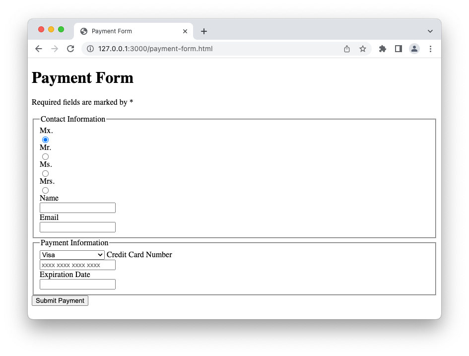
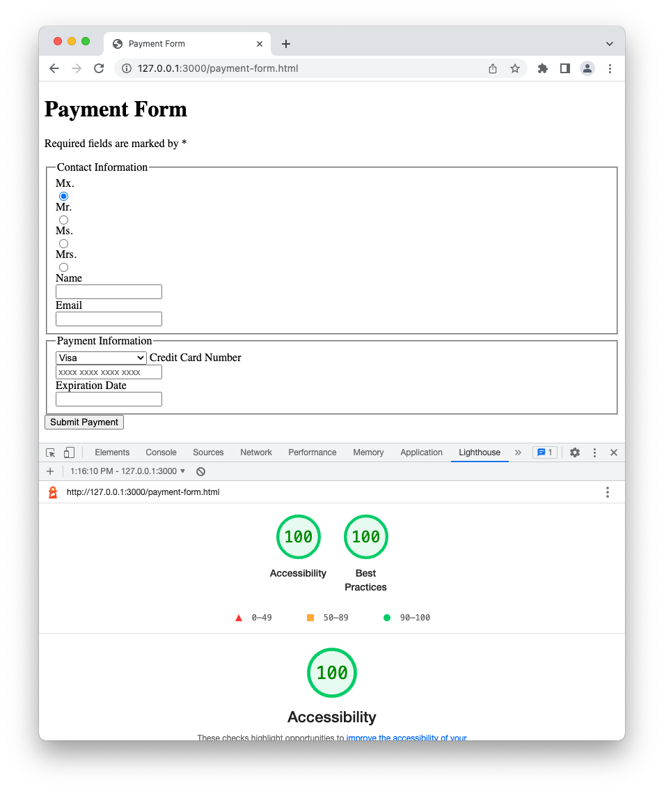

# Introduction to Forms Lab

In this lab, you will have an opportunity to build a form in HTML.

## Assessment Setup

### Getting started

1. Fork and clone this repository.

1. Navigate to the `settings` tab on GitHub, then choose `Pages` from the menu. Configure the `Build and Deployment` to have a `Source` of `Deploy from a branch` and select the `main` branch for deployment. Deployments can take a few minutes, so get started on the lab, and then be sure to check the deployment after you have made a few commits.

1. Open up the repository in VSCode. Follow the instructions below to complete the Lab.

## Instructions

Update the `index.html` file to display a form for entering payment information. It should like similar to this:

### Requirements

In addition to looking similar to the image above, make sure you meet the following requirements:

- [ ] Your submit button should be an `input` element, with the text `Submit Payment`.

- [ ] You should have all four radio buttons listed above.

- [ ] The first radio button should be `checked` by default.

- [ ] The other radio buttons should be deselected when a radio button is clicked.

- [ ] The Name field should be a text input, have a corresponding label tag, have an id of `name`, and be required.

- [ ] The Email field should be an email input, have a corresponding label tag, have an id of `email`, and be required.

- [ ] The Dropdown should include four options: "Visa", "Mastercard", "American Express", and "Discover".

- [ ] The Dropdown option's values should be "visa", "mastercard", "american-express", and "discover".

- [ ] The Credit Card field should be a `tel` type, have a placeholder of `xxxx xxxx xxxx xxxx`, and be required.

- [ ] The Expiration Date field should be a `text` type, have a corresponding label tag, have an id of `expiration-date`, and be required.

### Bonus

In Chrome Developer tools, there is a tab called `LightHouse`. Run a lighthouse audit for `Accessibility` and `Best Practices` (deselect other options).

To use this feature, run `npm install` to install `live-server` in the terminal. Then instead of using `open index.html`, you will type `npm start` to open your `index.html` page. `live-server` will also give you the benefit of automatically refreshing your page whenever you make changes to your project.

Use the audit to update your form so that you get a score of 100% For accessibility and best practices.

